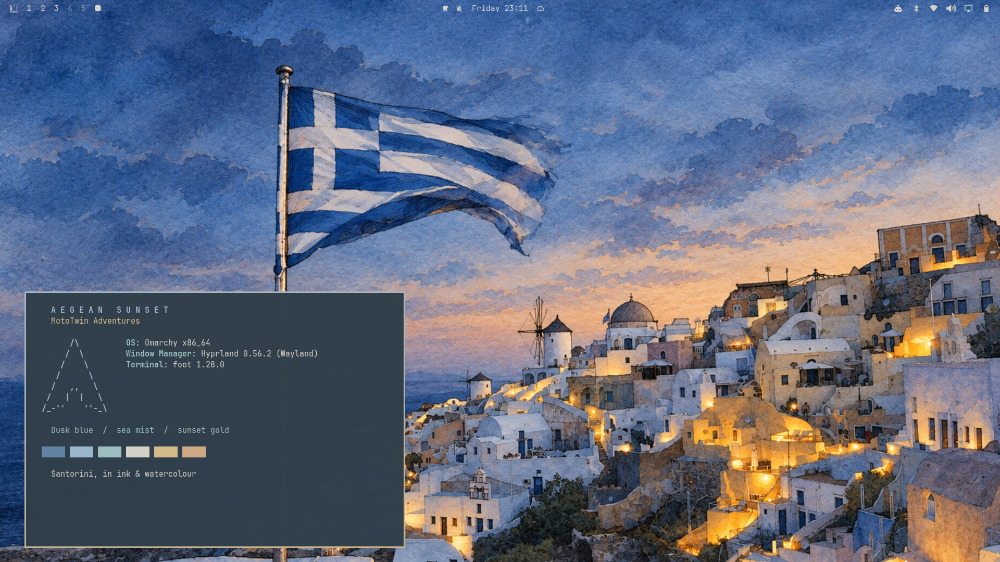

# Aegean Sunset

A soft, dark theme for **Omarchy 4**, inspired by Greek summers.

By [vespovios](https://github.com/vespovios) · [MotoTwin Adventures](https://mototwinadventures.com)



Muted dusk-blue surfaces, soft sandy text, pastel sea blues and gentle sunset-gold accents. Two wallpapers are included: the original Santorini photograph and an ink sketch with watercolour highlights.

## Install

```bash
omarchy theme install https://github.com/vespovios/omarchy-aegean-sunset-theme
```

Select it again at any time:

```bash
omarchy theme set "Aegean Sunset"
```

Cycle between the included wallpapers with:

```bash
omarchy theme bg next
```

## Palette

| Colour | Hex |
| --- | --- |
| Dusk background | `#303F4A` |
| Sandy text | `#D6D3C9` |
| Aegean blue | `#9DB8CD` |
| Sea mist | `#9DBFC0` |
| Sunset gold | `#D5BD8B` |
| Warm straw | `#D1AB85` |

Omarchy generates supported application themes from `colors.toml`. Blue Yaru icons complement the palette. The preview was captured on Omarchy with Hyprland and Foot; the presentation terminal is for the screenshot only.

## Wallpaper credit

Original photo by [Matt Artz](https://unsplash.com/@mattartz?utm_source=unsplash&utm_medium=referral&utm_content=creditCopyText) on [Unsplash](https://unsplash.com/photos/flag-of-greece-waving-at-pole-at-santorino-greece-KTwhQQf1yus?utm_source=unsplash&utm_medium=referral&utm_content=creditCopyText).

`backgrounds/santorini-ellas.jpg` is Matt Artz's original Santorini photograph, included under the Unsplash License. `backgrounds/santorini-ink-watercolour.png` is an AI-generated ink-and-watercolour interpretation of that photograph. No endorsement by the photographer is implied.

## License

Theme configuration and documentation are MIT licensed. Image assets are excluded from that license; see [WALLPAPER-CREDITS.md](WALLPAPER-CREDITS.md) for their provenance and the original photograph's license.
